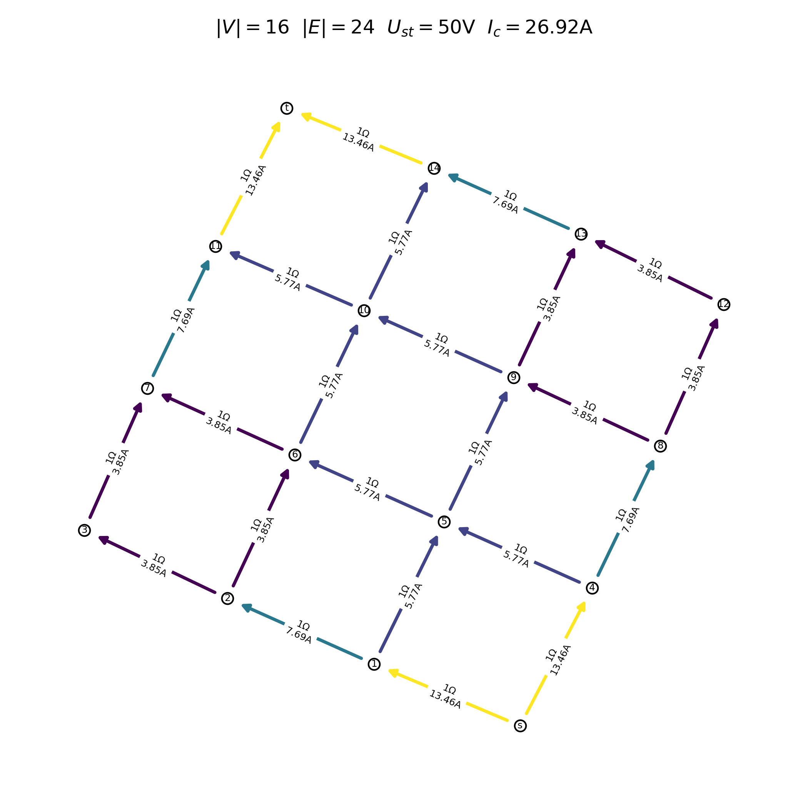
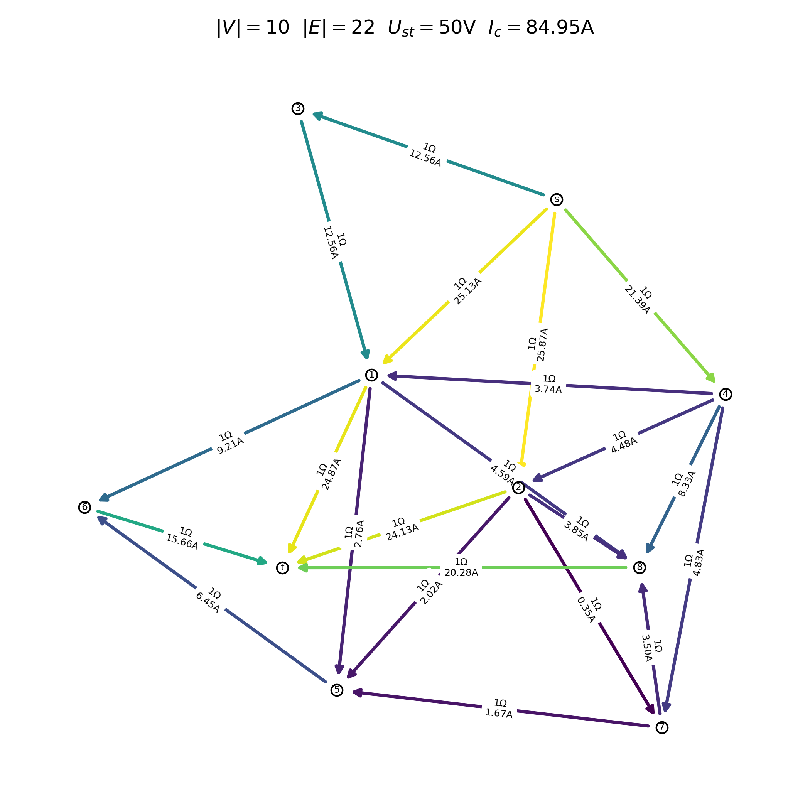

# Simple Circuit Analyzer
Project made during Computational Methods course as an example of solving problems 
with overdetermined system of equations.

Having a given simple circuit (consisting only of resistors) and two nodes, 
to which the voltage is applied, program finds the distribution 
of currents across every resistor.

The problem can also be considered in the context of social networks - the lesser the 
resistance between two nodes (people), the more often they interact with each other.
The voltage between two nodes would then be the number of interactions of two selected
people with a specific media material (information).
The distribution of currents could (theoretically) model how such information (material)
spreads among people in the network.

<p align="center">
  
  
</p>

Program loads circuit by reading network (graph) from file prepared as follows:
* first line: ```s_node_no t_node_no voltage_s_t```
* other lines: ```u_node_no v_node_no resistance_u_v```

and then by applying Kirchhoff's laws creates system of equations, which is solved 
using least squares method.
After that directed graph is generated using found solution to determine edges' values
and directions.
Such network can be saved to file:
* first line: ```current_flowing_through_electromotive_force_source```
* other lines: ```u_node_no v_node_no resistance_u_v current_flowing_from_u_to_v```

Also visualization of the distribution of currents can be displayed (and saved to .png file).
Every edge is directed and colored appropriately to current value (the warmer the edge 
color, the greater the current). Furthermore, edge labels (resistance and current) can be 
displayed.

Running 
```
python3 main.py 
```
will find the currents in test circuits (Erdos-Renyi graphs, grids, small-world networks)
and display the corresponding visualization.

Requirements:
* Graphviz >= 2.43.0
* Python >=3.9
* numpy >=1.22.3
* networkx >= 2.8
* matplotlib >= 3.5.1
* pydot >= 1.4.2
